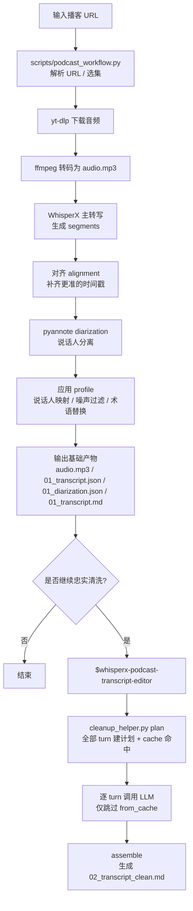

# WhisperX 播客下载与转录工作流

脚本入口：

```bash
python3 scripts/podcast_workflow.py --url "<podcast-url>"
```

这个脚本会自动完成：

1. 用 `yt-dlp` 解析并下载播客音频
2. 用 `ffmpeg` 转成 `audio.mp3`
3. 用 WhisperX 做转写、对齐、说话人分离
4. 产出：
   `audio.mp3`
   `01_transcript.json`
   `01_diarization.json`
   `01_transcript.md`

其中：

- `01_transcript.md` 是规则生成的结构稿，带 speaker、时间范围和较小 turn，主要给后续 LLM 精校消费
- `02_transcript_clean.md` 才是全文最终精校稿，由 skill 在 turn 级逐块调用 LLM 产出

## 整体流程图



在 macOS 上脚本默认会启用防休眠，避免锁屏或熄屏后任务因为系统睡眠中断。需要关闭时可加：

```bash
--no-keep-awake
```

如果你只想先把正文转出来，别让 `pyannote` 的说话人分离拖慢整个流程，可以加：

```bash
--skip-diarization
```

这时脚本仍会输出 `01_diarization.json`，但其中会标记 `"skipped": true`，正文也会退回成只有时间范围、没有说话人名的段落。

前置条件：

- 安装 `yt-dlp`
- 安装 `ffmpeg`
- 提供可访问 pyannote gated model 的 Hugging Face token

示例：

```bash
python3 scripts/podcast_workflow.py \
  --url "https://www.xiaoyuzhoufm.com/episode/69a64629de29766da93331ec" \
  --hf-token "$HF_TOKEN"
```

如果是节目页链接，非交互环境需要加：

```bash
--episode-index 1
```

如果你想固化节目术语、说话人名或噪声短语，请在 `scripts/podcast_profiles/` 下创建 profile。
